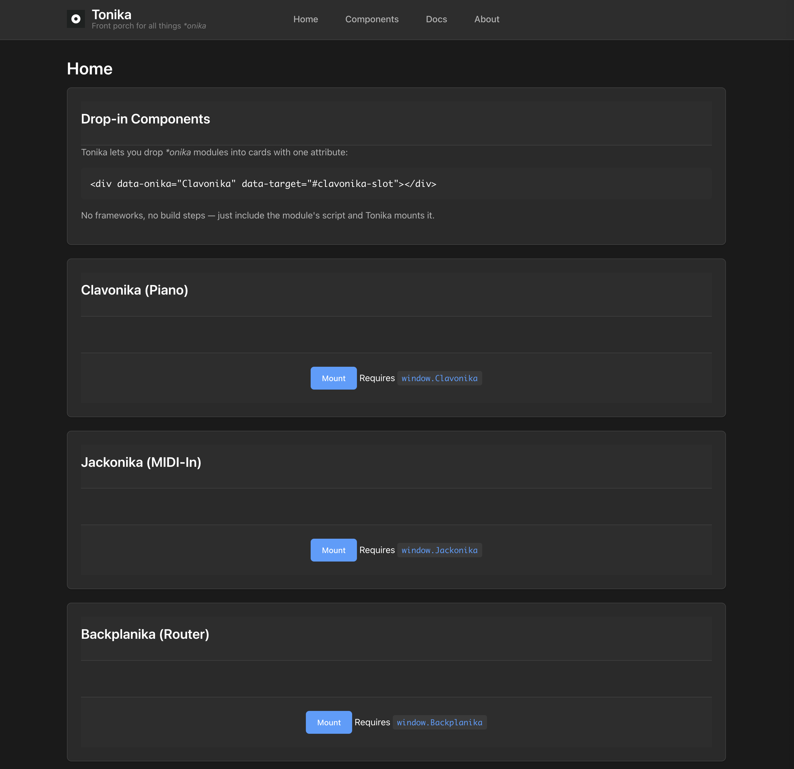

# Tonika 🪗✨

_The front porch for all things_ **_onika_**

---

## **🧙‍♂️ What is Tonika?**



Tonika is a **drop-in friendly front end** for the family of \*onika modules (Clavonika, Jackonika, Midonika, Backplanika, …).

Think of it as the **goblin porch**: you put your modules on the table, plug them in, and jam.

- **Zero fuss** → no build step, no frameworks, no dependencies.
- **Runs local / LAN** → designed for musicians, not sysadmins.
- **Material-ish cards** → every module lives in a neat little card.
- **One convention** → every \*onika module just exports a mount(el, opts) method.

---

## **🧰 Quick Start**

### **Requirements**

- Node.js v18+ installed.
- A modern browser (Chrome/Edge preferred for Web MIDI).

### **Run it**

```
git clone https://github.com/aa-parky/tonika.git
cd tonika/frontend
node server.js --host 0.0.0.0 --port 8080
```

Now open:

- http://127.0.0.1:8080 (on your own machine)
- or http://YOUR-LAN-IP:8080 (on tablet / laptop / phone on same Wi-Fi)

---

## **🪗 Drop-in Components**

Every \*onika module is just a **global object** that knows how to mount itself.

Example:

```
<!-- Include your bundle -->
<script defer src="/components/clavonika.iife.js"></script>

<!-- Add a card slot -->
<div id="clavonika-slot"></div>

<!-- Mount button -->
<button data-onika="Clavonika" data-target="#clavonika-slot">Mount</button>
```

Conventions:

- File name: clavonika.iife.js
- Global name: window.Clavonika
- API: Clavonika.mount(el, opts)

That’s it. No webpack, no config files.

---

## **🎛 Current Goblin Toys**

- **Clavonika** — Piano keyboard UI
- **Jackonika** — MIDI-In stompbox / monitor
- **Backplanika** — Micro router / patching
- **Midonika** — MIDI visualizer

---

## **📚 Docs (Goblin Draft)**

1. Copy your module bundle into public/components/.
2. Add a <script defer src="..."> to index.html.
3. Add a card with data-onika and data-target.
4. Profit. 🥁

We’ll keep adding images + naming guides so goblins and humans alike can plug’n’play.

---

## **👹 Goblin Philosophy**

- **Keep it simple, keep it local.**
- **One ritual to bind them all** → mount(el, opts).
- **Documentation with pictures** → less reading, more playing.
- **No dependencies** → if Node runs, Tonika runs.

---

## **📝 License**

MIT — go forth and patch.

---
